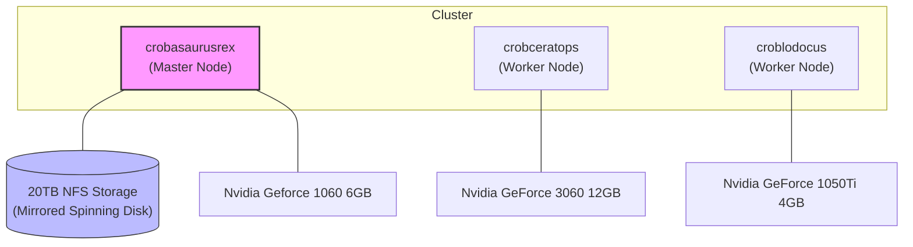

# personal-k8s-config

Welcome to my home kubernetes configuration!

## Features

Highlights of what is running here.

## Cluster Hardware

This cluster is composed of a mix of custom-built machines and repurposed hardware, providing a balance of compute, storage, and GPU acceleration.



### Hosts

| Hostname | Role | CPU | RAM | Storage | GPU |
| :--- | :--- | :--- | :--- | :--- | :--- |
| **crobasaurusrex** | Master | AMD Ryzen 7 3700X (8C/16T) | 32GB | 20TB Mirrored (NFS) | Nvidia GTX 1060 6GB |
| **crobceratops** | Worker | AMD Ryzen 5 5600X (6C/12T) | 32GB | 1TB Local | Nvidia RTX 3060 12GB |
| **croblodocus** | Worker | Intel Core i9-8950HK | 32GB | 2TB Local | Nvidia GTX 1050Ti 4GB |

---

### Renovatebot

Renovatebot is used to keep dependancies up to date. It will create a PR for each update and will auto merge if the PR is approved. It makes a majority of the work keeping everything up to date very hands off. When I haven't allowed auto merge on dependancies Renovate will (most of the time) show the changelog for the app so I can scan through for any breaking changes (eg: frigate, home-assistant). Auto merge is enabled for renovate itself, ollama octoprint and argocd, things that are stable release to release with the features I make use of.

To make all this work there is:
- Renovatebot cronjob in iac-services/renovatebot which runs daily within the cluster
- Renovate config for this repo in .github/renovate.json5 for specifying how to update dependencies in locations not natively supported by renovate (such as Deployment manifests).
- A github actions workflow to run dyff and show changes between commits, which is configured as a required check for PRs.
- Repository set to allow auto merge on PRs, and renovate configured to use platform commits and platform merge.

I'm pretty active in this repo day to day, but at a minimum the work to keep things up to date is a couple of PRs to scan over once a week.

### Envoy Gateway

[Envoy Gateway](https://gateway.envoyproxy.io/) is used to manage ingress, with the ingress-nginx deprecation I've switched to GatewayAPI which was very painless.

The Envoy Gateway contoller is configured in [ingress/envoy-gateway](./ingress/envoy-gateway), with a GatewayClass. The Gateways themselves are in [ingress/gateways](./ingress/gateways/), TLS termination happens at the gateway with their own wildcard certificates (configured with the gateways). Each app has it's own HTTPRoute.

The Gateways are using a LoadBalancer service to expose ports to the outside world. Within K3s that is done with ServiceLB which will open the ports on all nodes in the cluster.

### Certificates / Let's Encrypt

[Let's Encrypt](https://letsencrypt.org/) is used to manage certificates in the cluster. It is configured as a ClusterIssuer in [cluster-services/letsencrypt](./cluster-services/letsencrypt) for [cert-manager](https://cert-manager.io/) in [cluster-services/cert-manager](./cluster-services/cert-manager). The DNS challenge is used to manage certificates so that there are no exposed ports to the outside world.

### ArgoCD

[ArgoCD](https://argo-cd.readthedocs.io/en/stable/) is used to manage applications in the cluster, configured in [argocd](./argocd). I've enabled the terminal plugin to allow me to execute commands within pods from the argocd interface. Since TLS termination happens at the gateway, argocd is configured to be 'insecure', but it is not.

Argocd uses an ApplicationSet to find applications in this repo, it is configured in [argocd/applicationset](./argocd/applicationset). This allows me to drop a small argocd.yaml file in each application directory I want managed by argocd and it is then picked up by argocd on it's next background repo sync (minutes):
```yaml
argocd:
  name: application-name
  namespace: application-namespace
```

### Crossplane

Crossplane is used to manage infrastructure (some DNS entries mostly), configured in [crossplane](./crossplane). I've tried alternatives (Pulumi, tofu-operator), but crossplane is working and I'm not super invested in trying to make it better. There is a _huge_ barrier of entry to get started with crossplane which does put me off the project, but don't fix what ain't broke.

### Antigravity

I've been using the Antigravity IDE to manage this repo recently. There are some basic workflows in [.agent/workflows](.agent/workflows). This is a work in progress but right now it's functioning as an assistant that can complete a majority of the tasks in this repo I ask of it while I do something else.

## FAQs which are not asked frequently or otherwise, and also one isn't even a question

### Why would you make it public?

It's a demo showing I can run kubernetes and use it everyday. Am I in danger? I think this is all OK. We'll find out I guess.

### Is it any good?

Not really. It's always a work in progress and lots of things aren't commented to a standard I would leave in the workplace since this is just my home. It's been _much_ easier to maintain than stand alone systems, and if there is a new application I want to try out that's in a docker container I can have it running in about 15 minutes to test it out. It use to have a lot of k8s-at-home helm charts but they shut that down so I just went back to plain manifests. I find it easier to have the plain manifests than trying to find out what a helm chart does anyway, which needs a heavy reliance on the Dyff action so I can see what changes are actually being made. NixOS seems to be flavour of the month now but given I work every day with Kubernetes this just comes easier.

### Why run Kubernetes at home?
1. Work, 90% of my day job is this so it's just an easy extension to do this at home too, but it is incredibly easy too.
1. I took inspiration from [billimek/k8s-gitops](https://github.com/billimek/k8s-gitops/tree/master/default), however I've not referred to that in a long time now.
1. Seemed like an easy way to manage home assistant and other software.

## Bootstrap
If it breaks again, start here.
1. On master node `curl -sfL https://get.k3s.io | INSTALL_K3S_EXEC="--disable traefik" sh -s -`
1. Get the token from the master node `cat /var/lib/rancher/k3s/server/node-token`

1. On other nodes `curl -sfL https://get.k3s.io | K3S_URL=https://10.0.0.59:6443 K3S_TOKEN=${K3S_TOKEN} sh -s -`
1. On GPU nodes follow the driver install in the nvidia-gpu readme.
1. On all nodes make a `/stash` directory for local storage provisioning.
1. Check that `/stash` is in the `kube-system/local-path-config` configmap - K3s may change this. It's an issue at the moment but we will look at that later.

All the rest of these steps are on the on master node
1. Install kustomize, on ubuntu that is `curl -L https://github.com/kubernetes-sigs/kustomize/releases/download/kustomize%2Fv5.3.0/kustomize_v5.3.0_linux_amd64.tar.gz --output - | tar xzf - kustomize | sudo mv kustomize /usr/local/bin/kustomize`
1. Install helm `curl https://get.helm.sh/helm-v3.14.2-linux-amd64.tar.gz --output - | tar xzf - linux-amd64/helm | sudo mv linux-amd64/helm /usr/local/bin/helm`
1. Install github client `sudo apt-get install gh`
1. Authenticate gh client `/usr/bin/gh auth login` and follow instructions. Use SSH not http.
1. Checkout this repo to the master node `/usr/bin/gh repo clone ryanbeales/personal-k8s-config`
1. Install cert-manager with `/usr/local/bin/kustomize build cert-manager | sudo k3s kubectl apply -f -`
1. Create route53 secret access, see `./letsencrypt/README.md`
1. Add letsencrypt certificate issuer `/usr/local/bin/kustomize build letsencrypt | sudo k3s kubectl apply -f -`
1. Install ingress-nginx `/usr/local/bin/kustomize build ingress-nginx --enable-helm --helm-command /usr/local/bin/helm | sudo k3s kubectl apply -f -`
1. Install argocd with kustomize `/usr/local/bin/kustomize build argocd | sudo k3s kubectl apply -f -` - ignore CRD errors, the apps will be picked up after the secret is applied.
1. Follow argocd readme to create argocd repo secret.
1. At this point the rest of the cluster will then come up as best it can.
1. Created passwords for octoprint, photoprism, crossplane-providers, this will start these applications correctly.

Notes:
- The crossplane provider config `crossplane-providers/aws-provider-config.yaml` will not apply until other objects have applied first. You may have to remove this and add in the next sync. I'm not a fan of how this all works but we'll leave it in place for now.
- There may be some missing steps. Usually the README in each directory will explain what to do if the project goes wrong.

## Adding windows nodes
I have a gaming PC with a hefty nvidia card in it. I can install K3s via WSL on this PC to make it available to the cluster when I'm not gaming (often, these days).

On the windows PC (these may or may not be in order or complete)
1. Create a .wslconfig in your user directory:
```
[wsl2]
networkingMode=bridged
vmSwitch=WSL Switch
dnsTunneling = false
firewall = false

[network]
generateResolvConf = false
```
1. Install wsl2 `wsl --install` or reinstall (https://gist.github.com/4wk-/889b26043f519259ab60386ca13ba91b), hyper-v and hyper-v manager
1. Create a new External switch in hyper-v manager named `WSL-Switch`, connect it to your network interface
1. Install and Start the Ubuntu instance `wsl --install Ubuntu`
1. Install k3s node as above in the Bootstrap section
1. Install cuda on wsl2 https://docs.nvidia.com/datacenter/cloud-native/container-toolkit/latest/install-guide.html
1. Restart the k3s agent `sudo systemctl restart k3s-agent`
1. Verify that the nvidia runtime has been found by k3s: `sudo grep nvidia /var/lib/rancher/k3s/agent/etc/containerd/config.toml`

You may need to do this, I lost bout 8 hours of my life just trying to get this to work (is is worth it to get access to a 4090 in my k8s cluster? Maybe...)
```
Set-NetFirewallHyperVVMSetting -Name '{40E0AC32-46A5-438A-A0B2-2B479E8F2E90}' -DefaultInboundAction Allow
New-NetFirewallHyperVRule -Name VXLAN -DisplayName "VXLAN Fix" -Direction Inbound -VMCreatorId '{40E0AC32-46A5-438A-A0B2-2B479E8F2E90}' -Protocol UDP -LocalPorts 8472
```

## Testing configs
My notes here, download kustomize and helm, then run kustomize like this:
```
kustomize build . --enable-helm --helm-command helm
```
(or install via chocolaty or similar. this works though)