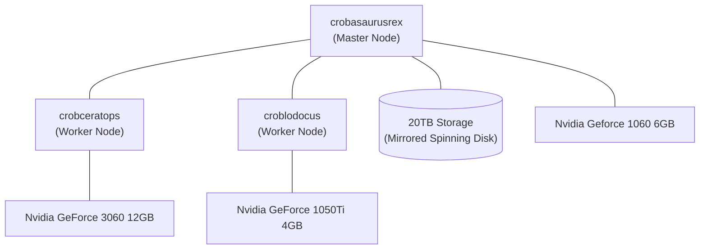

# personal-k8s-config

Welcome to my home kubernetes configuration!

### Why run Kubernetes at home?

1. Work, 90% of my day job is this so it's just an easy extension to do this at home too, but it is incredibly easy too.
1. I took inspiration from [billimek/k8s-gitops](https://github.com/billimek/k8s-gitops/tree/master/default), however I've not referred to that in a long time now.
1. Seemed like an easy way to manage home assistant and other software.

### Is the the Gold Standard of K8s Config?

Not really. It's always a work in progress and lots of things aren't commented to a standard I would leave in the workplace since this is just my home. It's been _much_ easier to maintain than stand alone systems, and if there is a new application I want to try out I can have it running in about 15 minutes. 

### Manifests vs Helm

Previously I relied heavily on helm charts, particularlly the k8s-at-home  charts, but since that repo was deprecated I just went back to plain manifests.

I find it easier to have the plain manifests than trying to find out what a helm chart does anyway, which needs a heavy reliance on the Dyff github action so I can see what changes are actually being made.

Eventually I'll switch to a custom operator or [KRO](https://kro.run/).

# Features

Highlights of what is running here.

## Renovatebot

Renovatebot is used to keep dependancies up to date. It will create a PR for each update and will auto merge if the PR is approved. It makes a majority of the work keeping everything up to date very hands off. When I haven't allowed auto merge on dependancies Renovate will (most of the time) show the changelog for the app so I can scan through for any breaking changes (eg: frigate, home-assistant). Auto merge is enabled for renovate itself, ollama octoprint and argocd, things that are stable release to release with the features I make use of.

To make all this work there is:
- Renovatebot cronjob in iac-services/renovatebot which runs daily within the cluster
- Renovate config for this repo in .github/renovate.json5 for specifying how to update dependencies in locations not natively supported by renovate (such as Deployment manifests).
- A github actions workflow to run dyff and show changes between commits, which is configured as a required check for PRs.
- Repository set to allow auto merge on PRs, and renovate configured to use platform commits and platform merge.

I'm pretty active in this repo day to day, but at a minimum the work to keep things up to date is a couple of PRs to scan over once a week.

## Envoy Gateway

[Envoy Gateway](https://gateway.envoyproxy.io/) is used to manage ingress, with the ingress-nginx deprecation I've switched to GatewayAPI which was very painless.

The Envoy Gateway contoller is configured in [ingress/envoy-gateway](./ingress/envoy-gateway), with a GatewayClass. The Gateways themselves are in [ingress/gateways](./ingress/gateways/), TLS termination happens at the gateway with their own wildcard certificates (configured with the gateways). Each app has it's own HTTPRoute.

The Gateways are using a LoadBalancer service to expose ports to the outside world. Within K3s that is done with ServiceLB which will open the ports on all nodes in the cluster.

## Certificates / Let's Encrypt

[Let's Encrypt](https://letsencrypt.org/) is used to manage certificates in the cluster. It is configured as a ClusterIssuer in [cluster-services/letsencrypt](./cluster-services/letsencrypt) for [cert-manager](https://cert-manager.io/) in [cluster-services/cert-manager](./cluster-services/cert-manager). The DNS challenge is used to manage certificates so that there are no exposed ports to the outside world.

## ArgoCD

[ArgoCD](https://argo-cd.readthedocs.io/en/stable/) is used to manage applications in the cluster, configured in [argocd](./argocd). I've enabled the terminal plugin to allow me to execute commands within pods from the argocd interface. Since TLS termination happens at the gateway, argocd is configured to be 'insecure', but it is not.

Argocd uses an ApplicationSet to find applications in this repo, it is configured in [argocd/applicationset](./argocd/applicationset). This allows me to drop a small argocd.yaml file in each application directory I want managed by argocd and it is then picked up by argocd on it's next background repo sync (minutes):
```yaml
argocd:
  name: application-name
  namespace: application-namespace
```

## Nvidia GPUs

I'm running a mix of old Nvidia GPUs in the cluster. I did use the Nvidia GPU operator at one point but this didn't work properly with my setup. Instead I've installed the components it manages separately, which is detailed in [cluster-services/nvidia-gpu](./cluster-services/nvidia-gpu). I'm using a timeslicing config to split each GPU in to 8 virtual GPUs for applications in the cluster. Because each GPU has vastly different performance I use `nodeSelector` to direct applications to the appropriate GPU by node name. Until [DRA](https://kubernetes.io/docs/concepts/scheduling-eviction/dynamic-resource-allocation/) is available this is the best I can do.

## Crossplane

Crossplane is used to manage infrastructure (some DNS entries mostly), configured in [crossplane](./crossplane). I've tried alternatives (Pulumi, tofu-operator), but crossplane is working and I'm not super invested in trying to make it better. There is a _huge_ barrier of entry to get started with crossplane which does put me off the project, but don't fix what ain't broke.

## Self-Hosted AI

I've added several self-hosted AI services into the cluster to provide local LLM capabilities, both out of interest of running these and also to make use of idle hardware instead of sending money elsewhere. 

- [Ollama](https://ollama.com/) provides the backend for running these models locally. I've attempted to use vllm too but Ollama "just works" on my small scale hardware.
- [SearXNG](https://searxng.org/) provides a metasearch engine to power web search tools for AI agents.
- [Open-WebUI](https://openwebui.com/) provides the interface for interacting with models.
- [ChromaImageGen](https://github.com/ryanbeales/chromaimagegen/tree/main) is my own small creation to provide local image generation using HuggingFace pipelines.

Home-assistant and Frigate are both configured to point to the Ollama instance in the cluster. Currently using the qwen3-vl:8b model for Frigate snapshot descriptions. Home assistant makes use of the same model as a Voice Assistant, but it is _slow_ on the 3060.

## Antigravity

I've been using the Antigravity IDE to manage this repo recently. There are some basic workflows in [.agent/workflows](.agent/workflows). This is a work in progress but right now it's functioning as an assistant that can complete a majority of the tasks in this repo I ask of it while I do something else.

# Cluster Hardware

The cluster is a mix of old custom-built desktops from old parts from my main desktop computer. As I upgrade it I take the old parts and build another computer for the cluster. This unfortunately means that every upgrade costs _more_ and with DDR5 prices what they are now (TODO: review this in a couple of years) I expect this is what it will remain as. There is also an old laptop that I use as a worker node. Every node has local storage, but the k3s master node also serves as the NFS storage for apps running elsewhere in the cluster.



I won't explain the naming convention except that I also acknowledge that it's strange, but I'm stuck with it now (do you know how many dinosaurs end in the same set of letters??).

## Hosts

| Hostname | Role | CPU | RAM | Storage | GPU |
| :--- | :--- | :--- | :--- | :--- | :--- |
| **crobasaurusrex** | Master | AMD Ryzen 7 3700X (8C/16T) | 32GB | 20TB Mirrored (NFS) | Nvidia GTX 1060 6GB |
| **crobceratops** | Worker | AMD Ryzen 5 5600X (6C/12T) | 32GB | 1TB Local | Nvidia RTX 3060 12GB |
| **croblodocus** | Worker | Intel Core i9-8950HK (6C/12T) | 32GB | 2TB Local | Nvidia GTX 1050Ti 4GB |

### Other hardware

In the past i've also included my main desktop as a worker node, it's running windows but I have k3s running in WSL2 (instructions are in [BOOTSTRAP.md](./BOOTSTRAP.md)). I've also had a Raspberry Pi 3 running as a k3s worker node, but I took it out as I have more than enough capacity with these nodes.

## Building the cluster

See [BOOTSTRAP.md](./BOOTSTRAP.md) for notes on how to build the cluster from scratch. 